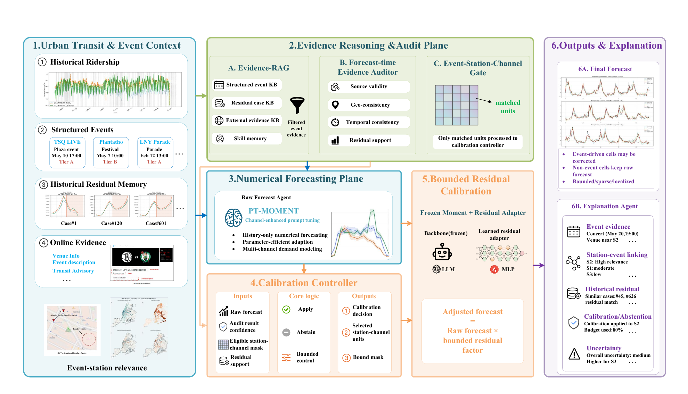

# EAF-MAS: Event-Aware Explainable Subway Ridership Forecasting

EAF-MAS is a numerical-backbone-first multi-agent framework for forecasting hourly subway ridership under planned urban events. It predicts passenger flow for 128 New York City subway station channels over a 192-hour horizon, while selectively activating event retrieval, evidence auditing, bounded calibration, and natural-language explanation for event-relevant stations.

The central design principle is separation of responsibilities:

- **PT-MOMENT** produces the default numerical forecast from historical ridership.
- **Event agents** determine whether a planned event is relevant to the forecast horizon and station scope.
- A **frozen-backbone residual adapter** may propose a sparse, bounded correction for event-related station-channel cells.
- A **forecast-time evidence auditor** and **calibration controller** accept the correction or abstain.
- **Evidence-RAG, Qwen-Plus, local Qwen3-8B, and AutoSkill-style memory** organize evidence and generate auditable explanations; they do not replace the numerical forecaster.

This repository contains the forecasting workflow, event-aware post-training pipeline, Evidence-RAG and auditing modules, AutoSkill-style explanation-memory experiments, numerical baseline interfaces, tests, and documentation.

## Framework



PT-MOMENT first generates a history-based raw forecast. Structured events, historical residual memory, and online evidence are organized by Evidence-RAG and checked by the Forecast-time Evidence Auditor. The Event-Station-Channel Gate localizes eligible units, after which the Calibration Controller either preserves the raw forecast or permits a bounded residual correction. The Explanation Agent records the evidence, station-event links, historical analogues, correction or abstention decision, and uncertainty.

### Agent roles

| Component | Responsibility | Changes forecast values? |
| --- | --- | --- |
| Numerical prediction agent | Generates the Top128, 192-hour PT-MOMENT forecast | Yes, as the numerical backbone |
| Event gate and analysis agents | Match events to forecast time, venue, station, and impact tier | No |
| Evidence-RAG | Retrieves structured events, train/validation residual analogues, and external/model-assisted evidence | No |
| Forecast-time evidence auditor | Scores source validity, geo-temporal alignment, semantics, and residual support | No |
| Frozen residual adapter | Proposes event-channel corrections bounded by the configured residual limit | Proposes corrections only |
| Calibration controller | Enforces evidence thresholds, channel masks, conflict checks, and correction bounds | Allows or rejects proposals |
| Explanation agent | Uses local Qwen3-8B to explain station relevance, residual support, bounds, exclusions, and abstention | No |
| AutoSkill-style memory | Evolves reusable routing, residual-memory, evidence, and abstention skills on validation experiences | No |

## Knowledge and Evidence Layers

EAF-MAS separates four forms of memory so their provenance and evaluation remain explicit:

1. **Structured event knowledge**: event time, venue, category, impact tier, confidence, duration, and station-channel matches.
2. **Historical residual memory**: train/validation-only PT-MOMENT residual analogues, including event type, day type, station rank, correction direction, dispersion, and effective sample size.
3. **External evidence memory**: verified or source-assisted retrieval records and Qwen-Plus model-assisted summaries. Non-citable summaries are never presented as verified citations.
4. **Skill memory**: validation-promoted routing, evidence-audit, residual-memory, and abstention instructions. The test split is read-only.

The explanation pipeline distinguishes forecast-time evidence from post-hoc metrics. Actual ridership, WAPE, and other evaluation results are not provided to the forecast-time LLM prompt.

## Dataset and Evaluation Scope

- **Top128 scope**: 128 New York City subway station channels
- **Event-focused scope**: 28 channels in the venue-to-Top128 intersection
- **Forecast horizon**: 192 hours
- **Formal split configuration**: 8,640 train rows, 2,880 validation rows, 2,689 exhaustive validation anchors, and 576 exhaustive test anchors

The full Top128 experiment evaluates the numerical backbone. Event-aware calibration, Evidence-RAG, and explanation experiments use the event-relevant 28-channel subset where appropriate. Test data is used for final reporting; adapter selection and skill promotion are restricted to train/validation data.

The processed ridership dataset, event records, channel mappings, and venue-station mappings will be released after paper acceptance.

## Installation

Python 3.10+ is recommended. Install the research dependencies in an isolated environment:

```bash
python -m venv .venv
source .venv/bin/activate
pip install --upgrade pip
pip install -r requirements.txt
```

CUDA, PyTorch, and vLLM builds are hardware-specific. Install a CUDA-compatible PyTorch/vLLM stack separately when running PT-MOMENT or local Qwen inference on GPU.

Datasets, model checkpoints, and generated experiment outputs are not included in this repository. They will be released after paper acceptance. See [`ARTIFACTS.md`](ARTIFACTS.md) for the planned release contents.

## LLM Services

### Local open-source explanation model

The explanation agent uses a local Qwen3-8B model served through an OpenAI-compatible vLLM endpoint. The workflow expects:

```text
http://127.0.0.1:8000/v1
served model name: Qwen/Qwen3-8B
```

Start vLLM with your local Qwen3-8B snapshot and verify `/v1/models` before running an explanation experiment.

### Qwen-Plus evidence enrichment

Qwen-Plus is optional and is used for high-value event summaries/evidence enrichment, not for numerical forecasting. Credentials are read only from runtime environment variables:

```bash
export OPENAI_BASE_URL="https://dashscope.aliyuncs.com/compatible-mode/v1"
export OPENAI_API_KEY="<your-runtime-key>"
export LLM_MODEL="qwen-plus"
```

Do not commit API keys, `.env` files, raw credentials, or private retrieval logs.

## Experiment Entry Points

| Study | Entry point | Purpose |
| --- | --- | --- |
| Full forecasting evaluation | `experiments/run_full_paper_results.py` | Top128 and event-subset forecast metrics |
| Event-aware case workflow | `experiments/run_paper_event_forecasting.py` | Evidence audit, controller decision, focused outputs, and explanations |
| Evidence Audit v3 | `experiments/run_evidence_audit_v3_fullstudy.py` | Source, geo-temporal, semantic, residual, and explanation diagnostics |
| AutoSkill SkillBench | `experiments/run_full_autoskill_skillbench.py` | Full-split explanation-memory lifecycle and effectiveness |
| Matched calibration ablation | `experiments/run_calibration_matched_ablation.py` | Controller/adapter ablation under matched forecast inputs |
| Event-stratified analysis | `experiments/analyze_event_stratified_results.py` | Robustness by event category and impact conditions |
| Gate coverage diagnostics | `experiments/run_gate_coverage_diagnostics.py` | Sparse station-channel intervention coverage |
| Runtime/cost profiling | `experiments/profile_eafmas_runtime_cost.py` | Numerical, retrieval, and LLM runtime accounting |
| Numerical baselines | `baseline/run_baselines.py` | Traditional and deep forecasting baseline interface |

Run `python <entry-point> --help` for the complete experiment-specific contract.

The dataset, checkpoints, and experiment artifacts required to reproduce the reported tables and figures will be published after paper acceptance.

## Repository Layout

```text
agents/                 Multi-agent workflow, Evidence-RAG, auditor, controller, explanation, and skill memory
event_post_training/    Strict prediction export, sample construction, and frozen residual-adapter training
experiments/            Formal runs, ablations, diagnostics, visualization, and paper-asset exporters
baseline/               Official-interface wrappers for traditional/deep numerical baselines
tests/                  Unit and regression tests for forecasting, evidence, skills, figures, and artifacts
momentfm/               Retained upstream MOMENT implementation used by the numerical backbone
```

## Testing

```bash
python -m unittest discover -s tests -v
python -m unittest discover -s experiments/visualization/tests -v
```

## Design Guarantees

- PT-MOMENT provides the history-based numerical forecast for all 128 station channels.
- The residual adapter applies sparse, event-relevant corrections within a predefined bound.
- Evidence-RAG and the LLM agents organize forecast-time evidence and produce structured explanations.
- AutoSkill-style memory supports residual-analogue selection, routing, multi-hop reasoning, and abstention consistency while keeping forecast arrays fixed across skill ablations.
- Weak or conflicting evidence triggers abstention and preserves the PT-MOMENT forecast.

## Acknowledgements

This project builds on the open-source [MOMENT](https://github.com/moment-timeseries-foundation-model/moment) implementation and uses its forecasting backbone within a new event-aware multi-agent pipeline. We also draw methodological inspiration from retrieval-augmented generation, ReAct-style tool reasoning, Reflexion, and AutoSkill-style experience-to-skill evolution.

The retained MOMENT implementation is distributed under its original MIT license; see [`THIRD_PARTY_NOTICES.md`](THIRD_PARTY_NOTICES.md). No license grant for the remaining EAF-MAS research code is implied by that third-party notice.

If you use the retained MOMENT implementation, please cite the original work:

```bibtex
@inproceedings{goswami2024moment,
  title     = {MOMENT: A Family of Open Time-series Foundation Models},
  author    = {Goswami, Mononito and Szafer, Konrad and Choudhry, Arjun and Cai, Yifu and Li, Shuo and Dubrawski, Artur},
  booktitle = {International Conference on Machine Learning},
  year      = {2024}
}
```

The EAF-MAS paper citation will be added after publication.
